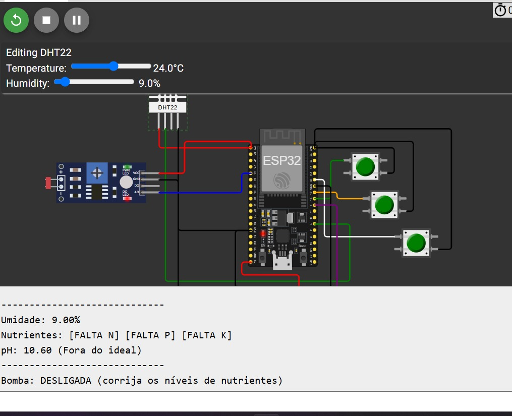
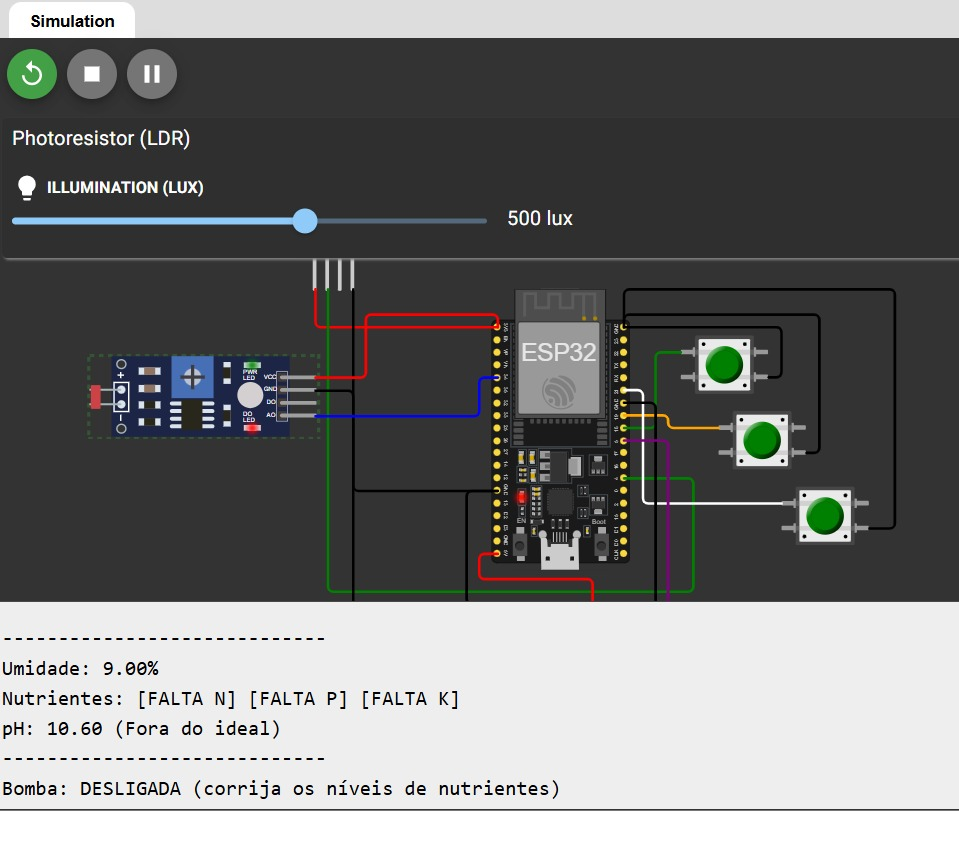
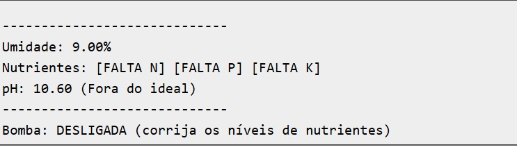

# 🌱 Sistema de Irrigação Inteligente para Tomateiros

Este projeto foi desenvolvido com o propósito de unir tecnologia e agricultura de forma prática e eficiente.  
Utilizando um microcontrolador **ESP32**, simulado na plataforma **Wokwi.com**, o sistema automatiza a irrigação de tomateiros com base em condições reais do solo — promovendo o uso consciente da água e o cuidado com a saúde das plantas.

---

## 🧩 Por que esse sistema é especial?

Mais do que simplesmente ligar uma bomba em horários fixos, este sistema toma decisões com base em **três fatores essenciais** para o desenvolvimento saudável do tomate:

- 🌧 **Umidade do solo**
- 🧪 **Presença de nutrientes (NPK)**
- ⚗️ **pH adequado**

A irrigação só acontece quando todas essas condições estão favoráveis, garantindo que a planta receba água no momento certo e em um ambiente químico ideal para absorção dos nutrientes.

---

## 🔍 Como o sistema decide quando irrigar?

A lógica é simples, mas poderosa.  
O sistema “pensa” de acordo com os seguintes critérios:

### ✅ Quando ligar a bomba
A irrigação será ativada **apenas se**:
- O solo estiver **seco** — umidade abaixo de **65%** (sensor DHT22).  
- Os nutrientes estiverem **disponíveis** — três botões de Nitrogênio (N), Fósforo (P) e Potássio (K) pressionados.  
- O pH estiver **ideal** — entre **6.0 e 7.0**, simulado por um sensor LDR.

Se qualquer uma dessas condições não for atendida, a bomba permanece desligada.

### ❌ Quando desligar a bomba
Mesmo após ser ligada, o sistema continua monitorando e pode desligar a irrigação se:
- A umidade ultrapassar **80%** (solo saturado).  
- A umidade estiver entre **65% e 80%** (solo já bem irrigado).  
- Alguma condição ideal deixar de ser verdadeira (por exemplo, botão de nutriente desativado ou pH fora da faixa).

---

## 🖥️ Comunicação com o Usuário — Monitor Serial

O sistema fornece feedback contínuo ao usuário, exibindo mensagens como:

- `LIGADA (condições ideais)`
- `DESLIGADA (pH do solo fora da faixa ideal)`
- `DESLIGADA (corrija os níveis de nutrientes)`
- `DESLIGADA (umidade do solo adequada)`
- `DESLIGADA (solo saturado)`

Essas mensagens ajudam o usuário a entender exatamente o motivo de cada decisão do sistema.

---

## 🔧 Componentes Utilizados na Simulação

| Componente Real       | Simulação no Wokwi     | Função                                   |
|------------------------|------------------------|-------------------------------------------|
| Sensor de Umidade      | DHT22                  | Detecta se o solo está seco               |
| Sensores de Nutrientes | 3 Botões               | Simulam presença de N, P e K              |
| Sensor de pH           | LDR                    | Mapeia a luz para a escala de pH          |
| Bomba d’Água           | Módulo Relé            | Liga/desliga a irrigação                  |
| Indicador Visual       | LED Verde              | Mostra visualmente o estado da bomba      |

---

## 🧪 Como Testar o Sistema

### 🌿 Cenário Ideal (bomba ligada)
1. Ajuste a umidade para menos de **65%**.  
2. Pressione os três botões de nutrientes.  
3. Ajuste o LDR para que o pH fique entre **6.0 e 7.0**.  
💡 Resultado: **LED verde aceso**, bomba ligada, e mensagem no monitor:  
`LIGADA (condições ideais)`

### 🚫 Cenário de Falha (bomba desligada)
1. Mantenha a umidade baixa e os nutrientes ativos.  
2. Ajuste o pH para fora da faixa (ex: **5.0**).  
💡 Resultado: bomba desligada, mensagem:  
`DESLIGADA (pH do solo fora da faixa ideal)`

### ⚙️ Cenário de Segurança (desligamento automático)
1. Com a bomba ligada, desative um dos botões de nutrientes.  
2. Ou aumente a umidade para mais de **80%**.  
💡 Resultado: bomba desliga imediatamente com a mensagem correspondente no monitor.

---

## 📸 **Imagens e Demonstração**

### Circuito no Wokwi  

### Simulação no ESP32  

### Saída do Monitor Serial  

---

## 📺 **Demonstração em Vídeo**

> **Link YouTube:**  
> [https://youtu.be/Ei3gy2853O4?si=rSCjallT5ZxaF3wz](https://youtu.be/Ei3gy2853O4?si=rSCjallT5ZxaF3wz)  

> **Link Wokwi:**  
> [https://wokwi.com/projects/444826807799729153](https://wokwi.com/projects/444826807799729153)

---

## 📘 Considerações Finais

Este projeto demonstra como a **tecnologia pode ser aplicada de forma inteligente na agricultura**.  
Ele não apenas automatiza o processo de irrigação, mas também **educa e empodera** o usuário, permitindo compreender melhor as condições de cultivo e tomar decisões mais sustentáveis.
